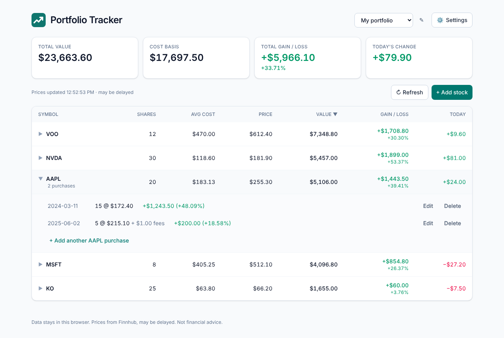

# Portfolio Tracker

A website to track the performance of your stock portfolio.

Enter a stock symbol, how many shares you bought, and the price you paid. Portfolio Tracker fetches the current market price and shows how much you have earned or lost — per position and for the whole portfolio.



## Features

- **Holdings** — add buys (multiple lots per stock), see price, value, weight, gain/loss $ and %, today’s change, holding period and annualized return
- **Sells & realized gains** — FIFO matching against your oldest shares; realized gain per sale and in total
- **Dividends & cash** — log dividends, set a cash balance; _Total return_ = unrealized + realized + dividends
- **Activity** — every buy, sale and dividend in one list, filterable, with edit/delete
- **Market-aware prices** — refresh every minute only while the market is open; pre-market and after-hours moves from Finnhub’s live trade stream
- **Charts** (optional) — allocation donut (by stock or industry), portfolio performance vs the S&P 500 (time-weighted), and stock comparison
- **Select & compare** — tick several holdings for their combined value, cost, gain, today’s move, realized gain and dividends; jump to a comparison chart
- **Returns & Sharpe** — YTD, 1-year, inception-to-date (and annualized), Sharpe ratio over 1/2/3/5 years, for the whole portfolio, your selection, each holding and the S&P 500; month-by-month returns for every year
- **Watchlist & price alerts** — follow stocks you don’t own; get a browser notification when a price crosses your target (while the site is open)
- **Backup & restore** — one-click backup file of everything (optionally with API keys); restore it after clearing browser data or on a new device, with a preview first. A reminder appears when you have changes that aren’t backed up.
- **CSV import/export** — import broker activity exports (Fidelity, Schwab, Robinhood-style) or your own export
- **Profiles** — separate portfolios in one browser, no login
- **Themes** — light, dark, black (OLED) or match your device
- **Install as an app** — PWA: add to home screen, opens offline with your last prices

## Tech stack

| Layer        | Technology                                                                          |
| ------------ | ----------------------------------------------------------------------------------- |
| App          | React 19 + TypeScript (Vite)                                                        |
| Styling      | Tailwind CSS v4                                                                     |
| Data         | Browser localStorage — no server, no login; multiple local profiles                 |
| Market data  | [Finnhub](https://finnhub.io) free API — each user enters their own key in Settings |
| Tests / lint | Vitest + React Testing Library, oxlint                                              |
| CI/CD        | GitHub Actions → GitHub Pages                                                       |

Live site (after first deploy): https://vmudinas.github.io/Portfolio_Tracker/

## Project status

Working: profiles, purchases, gain/loss, market-hours aware prices with pre/after-hours moves, optional trends chart, JSON backup. CSV import/export is next. See [docs/PLAN.md](docs/PLAN.md).

## Development

Requires Node 22+.

```bash
npm install
npm run dev        # http://localhost:5173/Portfolio_Tracker/
npm test           # unit + component tests
npm run lint       # oxlint
npm run format     # prettier
npm run typecheck  # tsc
npm run build      # production build in dist/
```

## Using the app

1. Get a free API key at [finnhub.io/register](https://finnhub.io/register).
2. Open the site → **Settings** → paste the key → Save. It is stored only in your browser.
3. **+ Add stock** (or **Load sample portfolio**). Use the profile menu to create separate portfolios.
4. Optional: add a free [Twelve Data](https://twelvedata.com/register) key in Settings, then click **📈 Chart**.

## Deployment

Pushing to `main` runs `.github/workflows/deploy.yml`, which tests, builds and publishes `dist/` to GitHub Pages.
One-time setup: **Settings → Pages → Source: GitHub Actions**.

> Disclaimer: this is a personal tracking tool, not financial advice. Quote data may be delayed.
